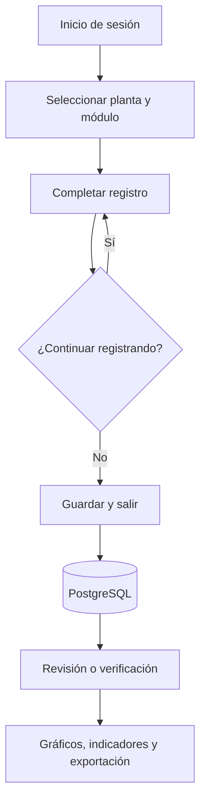
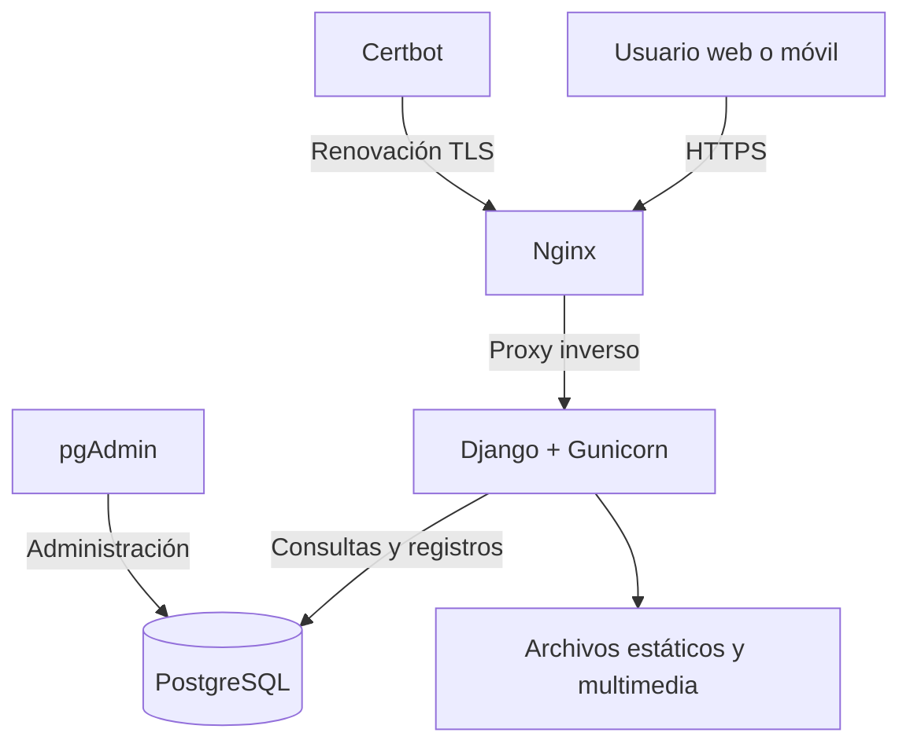
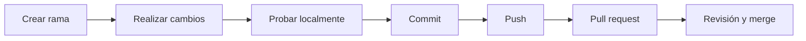

# SCG Quinta

Sistema web para digitalizar, centralizar y analizar registros de calidad y operación de Quinta S.A.

[](https://www.djangoproject.com/)
[](https://www.postgresql.org/)
[](https://docs.docker.com/compose/)
[](#licencia)

## Descripción

SCG Quinta transforma registros productivos y de calidad que antes se completaban en papel en información digital trazable. La plataforma permite ingresar datos desde dispositivos móviles, almacenarlos de forma centralizada, verificarlos, analizarlos mediante paneles y exportarlos para análisis complementarios.

## Objetivos

- Reemplazar registros manuales por formularios digitales.
- Mantener trazabilidad y respaldo histórico de la información.
- Facilitar la supervisión y verificación de registros.
- Visualizar indicadores operacionales y de calidad.
- Exportar información para análisis y reportería.
- Permitir el acceso diferenciado según usuario, planta y función.

## Flujo general de uso



## Módulos principales

| Área | Funcionalidades |
| --- | --- |
| Operaciones | Cálculo de OEE, turnos, detenciones, reprocesos e indicadores de producción. |
| Control de procesos | Control de pesos, alturas, parámetros de Gorreri, bizcochos, sala de cremas y temperatura post spiral. |
| Calidad e inocuidad | Monitoreo de agua, plagas, detector de metales, higiene, materiales extraños e incidentes. |
| Trazabilidad | Trazabilidad de productos, materias primas, ingredientes, lotes y proveedores. |
| Logística | Recepción, rechazo de materias primas, control de transporte y temperaturas de despacho. |
| Productos | Layout de tortas, productos, capas, pesos objetivo y pérdidas operacionales. |
| Análisis | Gráficos de control, paneles OEE, descargas Excel y visualización geográfica de ventas. |
| Administración | Usuarios, permisos, catálogos, verificación y administración mediante Django Admin. |

## Arquitectura

La solución se ejecuta con Docker Compose y separa la aplicación, la base de datos, la administración de datos, el proxy web y la renovación de certificados.



### Contenedores

| Servicio | Función |
| --- | --- |
| `web` | Aplicación Django servida mediante Gunicorn. |
| `db` | Base de datos PostgreSQL. |
| `pgadmin` | Administración visual de PostgreSQL. |
| `nginx` | Proxy inverso, HTTPS, archivos estáticos y multimedia. |
| `certbot` | Renovación automática de certificados TLS. |

## Tecnologías

- Python 3.9
- Django 4.2.4
- PostgreSQL 17.5
- Gunicorn 20.1
- Nginx 1.27.5
- pgAdmin 9.3
- Docker y Docker Compose
- HTML, CSS y JavaScript
- pandas y openpyxl para procesamiento y exportación de datos

## Estructura del proyecto

```text
SCG_Quinta/
├── Back-end/
│   └── SCG_Quinta/
│       ├── SCG_Quinta/          # Configuración global de Django
│       ├── calculo_oee/         # OEE, turnos y detenciones
│       ├── control_de_pesos/    # Registros y gráficos de peso
│       ├── control_layout_tortas/
│       ├── trazabilidad_productos/
│       ├── inicio/              # Menús y permisos
│       ├── login/               # Autenticación y usuarios
│       ├── config/nginx/        # Configuración del proxy
│       ├── docker-compose.yml
│       ├── Dockerfile
│       ├── manage.py
│       └── requirements.txt
└── README.md
```

## Requisitos

Para la ejecución mediante contenedores solo se requiere:

- Git
- Docker Engine o Docker Desktop
- Docker Compose v2

Python, Django, PostgreSQL y el resto de las dependencias se instalan dentro de los contenedores.

## Instalación local

### 1. Clonar el repositorio

```bash
git clone https://github.com/diegosaldiasq/SCG_Quinta.git
cd SCG_Quinta/Back-end/SCG_Quinta
```

### 2. Configurar las variables de entorno

Crea un archivo `.env` local a partir de un archivo de ejemplo y completa los valores requeridos:

```bash
cp .env.example .env
```

Variables recomendadas:

```dotenv
DJANGO_SECRET_KEY=cambiar-por-una-clave-segura
DJANGO_DEBUG=True
DJANGO_ALLOWED_HOSTS=localhost,127.0.0.1
POSTGRES_DB=SCG_Quinta
POSTGRES_USER=postgres
POSTGRES_PASSWORD=cambiar-por-una-clave-segura
DATABASE_HOST=db
GOOGLE_GEOCODING_API_KEY=
PGADMIN_DEFAULT_EMAIL=
PGADMIN_DEFAULT_PASSWORD=
```

> Nunca publiques contraseñas, claves privadas, `SECRET_KEY` ni claves de API en Git. El archivo `.env` debe estar incluido en `.gitignore`.

### 3. Construir e iniciar los servicios

```bash
docker compose up -d --build
```

### 4. Preparar Django

```bash
docker compose exec web python manage.py migrate
docker compose exec web python manage.py collectstatic --noinput
docker compose exec web python manage.py createsuperuser
```

### 5. Acceder

- Aplicación: `http://localhost/`
- Administración Django: `http://localhost/admin/`
- pgAdmin: habilitar el puerto local en `docker-compose.yml` solo cuando sea necesario.

## Comandos habituales

```bash
# Estado de los contenedores
docker compose ps

# Ver registros de la aplicación
docker compose logs -f web

# Reiniciar un servicio
docker compose restart web

# Aplicar migraciones
docker compose exec web python manage.py migrate

# Recolectar archivos estáticos
docker compose exec web python manage.py collectstatic --noinput

# Detener los servicios
docker compose down
```

## Flujo de desarrollo



Ejemplo:

```bash
git switch -c feature/nombre-del-cambio
git status
git add ruta/del/archivo
git commit -m "feat: descripción breve del cambio"
git push -u origin feature/nombre-del-cambio
```

Evita trabajar directamente sobre `main` y revisa siempre los archivos que serán incluidos antes de ejecutar el commit.

## Migraciones

Después de modificar un modelo:

```bash
docker compose exec web python manage.py makemigrations nombre_app
docker compose exec web python manage.py migrate
docker compose exec web python manage.py showmigrations nombre_app
```

Las migraciones generadas deben quedar versionadas junto con el cambio del modelo.

## Archivos estáticos

Después de modificar CSS, JavaScript o imágenes en producción:

```bash
docker compose exec web python manage.py collectstatic --noinput
docker compose restart web nginx
```

El proyecto utiliza almacenamiento con manifiesto para generar nombres versionados y reducir problemas de caché.

## Pruebas y validaciones

Antes de publicar cambios se recomienda ejecutar:

```bash
docker compose exec web python manage.py check
docker compose exec web python manage.py test
```

También se debe validar manualmente:

- Inicio y cierre de sesión.
- Permisos según perfil de usuario.
- Registro, edición y verificación de datos.
- Visualización móvil y de escritorio.
- Gráficos, filtros y exportaciones.
- Migraciones sobre una copia de respaldo de la base de datos.

## Despliegue

Flujo recomendado para actualizar el servidor:

```bash
git pull origin main
docker compose up -d --build
docker compose exec web python manage.py migrate
docker compose exec web python manage.py collectstatic --noinput
docker compose ps
```

Antes de actualizar producción, genera un respaldo de la base de datos y revisa las migraciones pendientes.

## Seguridad

- Mantén `DEBUG=False` en producción.
- Obtén credenciales y claves mediante variables de entorno.
- Rota inmediatamente cualquier secreto que haya sido publicado en el repositorio.
- Restringe el acceso externo a PostgreSQL y pgAdmin.
- Utiliza HTTPS y cookies seguras en producción.
- Mantén respaldos periódicos y prueba su restauración.
- No utilices comandos de limpieza de Docker sin revisar previamente qué imágenes, contenedores y volúmenes serán afectados.

## Contribución

1. Crea una rama desde `main`.
2. Implementa y prueba el cambio.
3. Usa commits breves y descriptivos.
4. Publica la rama.
5. Abre un pull request explicando el objetivo, los archivos modificados y las pruebas realizadas.


## Para mantenimiento del seervidor en AWS

Para mantenimiento del servidor en AWS, se debe conectar a la instancia de AWS, una vez abierto el terminal, se debe ejecutar el comando `sudo du -h /var/lib/docker --max-depth=1 | sort -hr` para ver el espacio ocupado por los contenedores de docker. Para eliminar los contenedores que no se estan usando, se debe ejecutar el comando `docker system prune -a` para eliminar los contenedores, imagenes y volumenes que no se estan usando. Para una limpieza mas profunda, se debe ejecutar el comando `docker builder prune -a` para eliminar las imagenes que no se estan usando. `docker system prune -a -f` para eliminar los contenedores, imagenes y volumenes que no se estan usando sin pedir confirmacion.

Para actualizaciones de ubuntu se debe ejecutar el comando `sudo apt update` para actualizar la lista de paquetes disponibles, luego ejecutar el comando `sudo apt upgrade -y` para actualizar los paquetes instalados, `sudo apt autoremove -y` para eliminar paquetes que ya no son necesarios. Para reiniciar el servidor se debe ejecutar el comando `sudo reboot` para reiniciar la instancia de AWS.

## Licencia

Este proyecto se distribuye bajo la licencia MIT. Consulta el archivo `LICENSE` para conocer el texto completo.

## Autor

Desarrollado y mantenido por **Diego Saldías Quijada**.